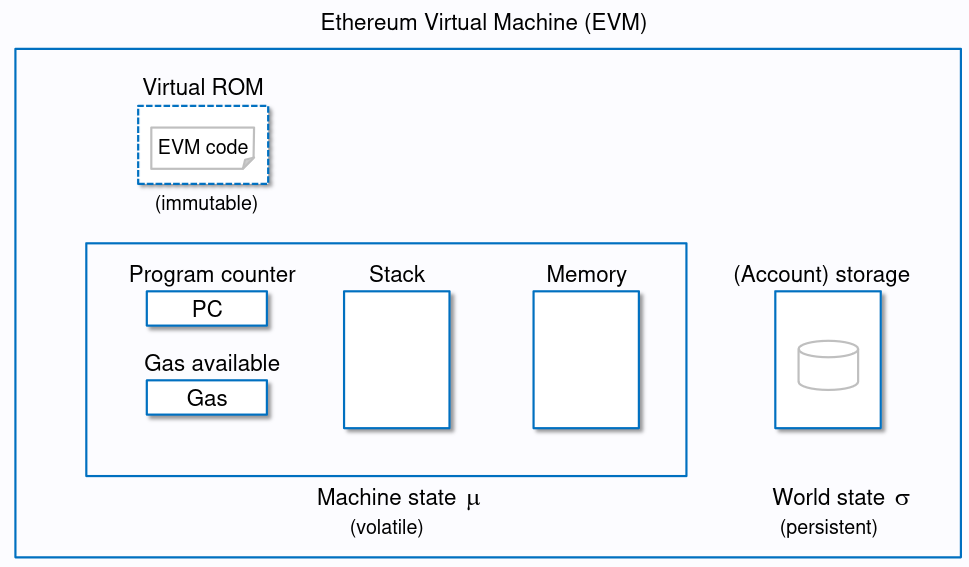

# EVM Basics

The Ethereum Virtual Machine is a stack-based computer, i.e. all instructions take their parameter from the stack (except `PUSHx`, which takes it from the code). It is deterministic, so it will always provide the same outputs for the same inputs, no matter the machine it is run on.

When the EVM executes a smart contract, it creates an execution context. It contains several data regions, a program counter, and other information like the current caller and the address of the current code. See the image below for more information.

## Stack

### Basics

The stack is a LIFO (last in, first out) data structure. It is used to store data and intermediate results during execution. The stack has a maximum size of 1024 elements, but only the first 16 elements are accessible -- if you try to access an element further down, you run into the infamous `Stack too deep` error. Each element on the stack has a size of 256 bits.

### Gas costs related to the stack

All instructions interact with the stack in one way or another. Pushing data on top of the stack (PUSHx) costs 3 gas, while popping data from the stack (POP) costs 2 gas.

## Memory

### Basics

Contract memory is a byte array where data can be stored in 32-byte or 1-byte chunks and read in 32-byte chunks. Elements in memory always occupy multiples of 32 bytes, even if the data uses fewer bytes. Unlike with contract storage, there is no variable packing. Memory is temporary and only exists during the execution of a transaction.

Solidity reserves four 32-byte slots, with specific byte ranges (inclusive of endpoints) being used as follows:

- `0x00` to `0x3f`: scratch space for hashing method
- `0x40` to `0x5f`: free memory pointer (currently allocated memory size)
- `0x60` to `0x7f`: zero slot

The zero slot is used as the initial value for dynamic memory arrays and should never be written to. This also means that the free memory pointer points to `0x80` initially. Memory is never freed, so the free memory pointer only increases.

> Sidenote: The bytecode sequence `6080604052` you see at the start of the runtime bytecode of almost every contract is the initialization of the free memory pointer. It is the bytecode for `mstore(0x40, 0x80)`, which stores the value `0x80` at memory location `0x40`.

### Gas costs related to memory

The opcodes related to memory are:

All three opcodes have a static gas cost of 3 and a dynamic gas cost related to the memory expansion cost.

#### Memory expansion

If you write to or read from a memory location that is not yet allocated, the memory is expanded in 32-byte chunks. The cost of this expansion is:

where `a` is the size of the memory.

From the Yellowpaper:

> Note also that C_mem is the memory cost function (the expansion function being the difference between the cost before and after). It is a polynomial, with the higher-order coefficient divided and floored, and thus linear up to 704B of memory used, after which it costs substantially more.

This is also referred to as memory explosion since the cost of expanding memory is not linear but quadratic.

> Run `forge test --mc MemoryTest -vvvv` to see the gas costs and the costs of memory expansion in detail. The optimizer has to be disabled to show accurate gas costs.

## Storage

### Basics

Contract storage is a key-value store that maps 256-bit words to 256-bit words. All locations in storage are well-defined initially as zero. All data, except for dynamically sized arrays and mappings, is laid out one after another in storage starting from slot 0.

Multiple variables can be stored in the same slot if they fit. This is called variable packing:

- The first item in a storage slot is stored lower-order aligned (it uses the lowest available bits).
- Value types use only as many bytes as are necessary to store them (e.g. uint8 uses 1 byte).
- If a value type does not fit the remaining part of a storage slot, it is stored in the next slot.
- Structs and array data always start a new slot, and their items are packed tightly according to these rules.
- Items following struct or array data also start a new storage slot.

Dynamically sized arrays and mappings cannot be stored in between the other state variables:

- The length of an array is stored in slot `x` according to the rules above, while the data of the array starts at `slot(keccak256(x))`.
- Mappings reserve a storage slot `x` according to the rules above, but there is no data stored in it. The storage slot is used to compute the location of the value in the mapping: `slot(keccak(key, x))`.

We can inspect the storage of smart contracts with `forge inspect MyContract storage` or, when slither is installed, with `slither <path_to_contract> --print variable-order`. Run `forge inspect StorageLayout storage` for an example.

### Gas costs related to storage

The opcodes related to storage are `SLOAD` and `SSTORE`. Storage reads and writes are, besides contract creation (which costs at least 32k gas), the most expensive operations in the EVM. Both have a minimum cost of 100 gas and an additional cost depending on the state of the storage slot.

**Storage writes**

- zero -> nonzero: 20k gas

  > G_sset = 20k gas

- nonzero -> nonzero: 2.9k gas

  > G_sreset = 2.9k gas

- nonzero -> zero: refund

  > Refund 4800 gas per cleared storage var (since EIP-3529)
  > Refunds are capped to total_gas_used / 5; to get a refund of 4800 gas, the transaction needs to use 24k gas at a minimum

- zero -> zero: 100 gas
  > G_warmaccess = 100 gas

If a storage variable is accessed the first time in a transaction, it costs an additional 2.1k gas (G_coldsload). If a storage variable was already written to (the storage slot is 'dirty'), each additional write in the same transaction costs 100 gas.

**Storage reads**

- Storage read (cold): 2.1k gas

  > G_coldsload = 2100 gas

- Storage read (warm): 100 gas
  > G_warmaccess = 100 gas

**Accesslist**

Since EIP-2930, it is possible to specify a list of addresses and storage keys that will be touched during the transaction execution. When an address or storage slot is present in that list, it is called "warm"; otherwise, it is "cold." This allows reducing the gas costs for storage reads and writes as seen in the image above. See the links in the references for more information.

> Run `forge test --mc StorageTest -vvvv` to see the gas costs in detail. The optimizer has to be disabled to show accurate gas costs.

## Calldata

### Basics

Calldata is very similar to memory, but it is read-only. Calldata can only be used in external function calls and is used to pass arguments to functions. The Yellowpaper defines the calldata as

> an unlimited size byte array specifying the input data of the message call

Calldata is assumed to be in a format defined by the ABI specification, which means padded to multiples of 32 bytes.

<!--  -->

### Gas costs related to calldata

The opcodes related to calldata are:

`CALLDATALOAD` and `CALLDATASCOPY` have a static gas cost of 3, while `CALLDATASIZE` has a static gas cost of 2. There is no dynamic cost in contrast to memory.

A byte of calldata costs either 4 gas (if it is zero) or 16 gas (if it is any other value). The gas cost for non-zero bytes was reduced from 68 to 16 with EIP-2028 to increase the scalability of L2s.

**While calldata is cheap on mainnet, it isn't on Layer 2s.** This is because rollups pay cheap layer-2 fees for execution and storage but expensive layer-1 fees to publish their data on Ethereum.

The calldata costs will be significantly reduced with proto-danksharding (EIP-4844). For now, there are calldata compression techniques that can be used to reduce the gas costs, such as [LibZip](https://github.com/Vectorized/solady/blob/main/src/utils/LibZip.sol), which is using selective run length encoding (RLE) to reduce the calldata size.

To see the gas costs yourself, follow the instructions in `script/Calldata.s.sol`.

## References

- [Ethereum Yellowpaper](https://ethereum.github.io/yellowpaper/paper.pdf)
- [Ethereum EVM Illustrated (2018)](https://takenobu-hs.github.io/downloads/ethereum_evm_illustrated.pdf)

A great resource to estimate gas costs of various opcodes is [evm.codes](https://evm.codes/)

### Storage

- [Solidity Internals: Layout in Storage](https://docs.soliditylang.org/en/latest/internals/layout_in_storage.html)
- [Understanding Ethereum Smart Contract Storage](https://programtheblockchain.com/posts/2018/03/09/understanding-ethereum-smart-contract-storage/)
- [EVM Deep Dives: The Path to Shadowy 3EA](https://noxx.substack.com/p/evm-deep-dives-the-path-to-shadowy-3ea?s=r)
- [Diving into the Ethereum VM: The Hidden Costs of Arrays](https://medium.com/@hayeah/diving-into-the-ethereum-vm-the-hidden-costs-of-arrays-28e119f04a9b)
- [EIP-3529](https://eips.ethereum.org/EIPS/eip-3529)
- [evm.storage](https://evm.storage/)
- [EIP-2930: Access Lists](https://eips.ethereum.org/EIPS/eip-2930)
- [@libevm - Access Lists](https://twitter.com/libevm/status/1523141360076812288)

### Memory

- [Solidity Internals: Layout in Memory](https://docs.soliditylang.org/en/latest/internals/layout_in_memory.html)
- [EVM Deep Dives: The Path to Shadowy D6B](https://noxx.substack.com/p/evm-deep-dives-the-path-to-shadowy-d6b?s=r)

### Calldata

- [Solidity Internals: Layout in Calldata](https://docs.soliditylang.org/en/latest/internals/layout_in_calldata.html)
- [Solidity ABI Specification](https://docs.soliditylang.org/en/latest/abi-spec.html)
- [EIP-4844](https://eips.ethereum.org/EIPS/eip-4844)
- [EIP-2028](https://eips.ethereum.org/EIPS/eip-2028)
- [Short ABI - Ethereum Developers](https://ethereum.org/en/developers/tutorials/short-abi/)
- [Rollup Calldata Compression](https://l2fees.info/blog/rollup-calldata-compression)
